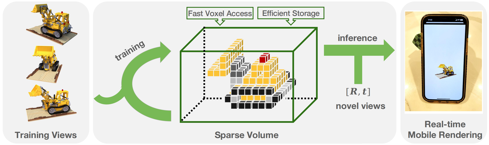

# PlenVDB: Memory Efficient VDB-Based Radiance Fields for Fast Training and Rendering (CVPR2023)

<p align='center'>
    
</p>

### [project page](https://plenvdb.github.io/) | [paper](https://openaccess.thecvf.com/content/CVPR2023/papers/Yan_PlenVDB_Memory_Efficient_VDB-Based_Radiance_Fields_for_Fast_Training_and_CVPR_2023_paper.pdf)


Code release for the CVPR 2023 paper "PlenVDB: Memory Efficient VDB-Based Radiance Fields for Fast Training and Rendering"

*Han Yan, Celong Liu, Chao Ma, Xing Mei*


## Visualization


## Table of Contents:
- [News](#news)  
- [File Tree](#filetree)  
- [Installation](#intallation)
    - [Compile OpenVDB, NanoVDB, PyOpenVDB](#install1)
    - [Env Setting](#install2)
    - [Compile PlenVDB](#install3)
- [Prepare Dataset](#dataset)
- [Training](#training)
- [TODO List](#todos)  
- [Citation](#citation)  


## News <a name="news"></a>

- [2023/05/28] Code initial release `v1.0`
- [2023/02/28] PlenVDB is accepted by CVPR 2023.

## File Tree <a name="filetree"></a>
<details>
    <summary> File tree (click to expand) </summary>

```text
.PlenVDB  
├── doc  
│   └── additional_cmds.md  
├── figs  
│   └── teaser.png  
├── openvdb  
│   └── ...  
├── plenvdb  
│   ├── configs  
│   │   └── ...  
│   ├── cuda  
│   ├── lib  
│   │   ├── ...  
│   │   └── vdb  
│   │       ├── CMakeLists.txt  
│   │       ├── colorvdb.cu  
│   │       ├── densityvdb.cu  
│   │       ├── plenvdb.cpp  
│   │       ├── plenvdb.cu  
│   │       ├── plenvdb.cuh  
│   │       ├── plenvdb.h  
│   │       └── renderer.cu  
│   ├── LICENSE  
│   ├── requirements.txt  
│   ├── run.py  
│   ├── tools  
│   └── vdb_compression.py  
└── README.md  
```
</details>

## Installation <a name="installation"></a>

### Requirements <a name="requirements"></a>

- Ubuntu, python==3.7, g++>=6.3.1, gcc>=6.3.1, CMake>=3.18.0, Boost>=1.70, TBB>=2019.0, Blosc>=1.7.0
- pytorch and torch-scatter is dependent on CUDA, please install the correct version for your machine

### 1. Compile OpenVDB, NanoVDB, PyOpenVDB <a name="install1"></a>

First, let's compile OpenVDB, NanoVDB and the python module. We mainly focus on **PlenVDB/openvdb** directory, which is an old version of [OpenVDB library](https://github.com/AcademySoftwareFoundation/openvdb). We have tested on g++7.5.0, gcc7.5.0, make3.18.0,libboost1.74 tbb2019 and libblosc1.7.0. And you can go to **PlenVDB/openvdb/cmake/config/OpenVDBVersions.cmake** for detailed version requirements about the dependencies. If you have some trouble with the dependencies, we hope the commands in the **[Additional Commands](doc/additional_cmds.md)** will help.

When all dependencies are ready, run

```bash
cd PlenVDB/openvdb
mkdir build
cd build
cmake -DOPENVDB_BUILD_NANOVDB=ON -DOPENVDB_BUILD_PYTHON_MODULE=ON -DUSE_NUMPY=ON ..
sudo make -j4
sudo make install
```

### 2. Env Setting <a name="install2"></a>

Second, let's create an environment for running. Here we give the CUDA10.2 version.

```bash
# cd PlenVDB/plenvdb/
conda create -n plenvdb python=3.7
conda activate plenvdb
conda install pytorch==1.10.1 torchvision==0.11.2 torchaudio==0.10.1 cudatoolkit=10.2 -c pytorch
pip install -r requirements.txt
pip install -i https://pypi.tuna.tsinghua.edu.cn/simple/  pytest
pip install torch-scatter -f https://data.pyg.org/whl/torch-1.10.1+cu102.html
pip install imageio-ffmpeg
```

### 3. Compile PlenVDB <a name="install3"></a>

Third, let's compile the plenvdb.so, which is a VDB-based data structure.

```bash
cd PlenVDB/plenvdb/lib/vdb/
mkdir build
cd build
cmake ..
make -j4
```

If you meet with some difficulties in compilation, I recommende you to read its [repository](https://github.com/AcademySoftwareFoundation/openvdb) or [document](https://www.openvdb.org/documentation/doxygen/build.html).

## Prepare Datasets <a name="dataset"></a>

Download [NeRF-Synthetic](https://drive.google.com/drive/folders/128yBriW1IG_3NJ5Rp7APSTZsJqdJdfc1), [NSVF](https://dl.fbaipublicfiles.com/nsvf/dataset/Synthetic_NSVF.zip), [BlendedMVS](https://dl.fbaipublicfiles.com/nsvf/dataset/BlendedMVS.zip), [DeepVoxels](https://drive.google.com/open?id=1ScsRlnzy9Bd_n-xw83SP-0t548v63mPH).

Modify configurations in **PlenVDB/plenvdb/configs** to indicate the **datadir**.


## Training <a name="training"></a>

Run for mic and get finedensity.vdb and finecolor.vdb

```bash
cd PlenVDB/plenvdb/
python run.py --config configs/nerf/mic.py 
```

Merge two VDBs into one: mergedidxs.vdb and mergeddata.npz

```bash
python vdb_compression.py --basedir logs/nerf_synthetic/ --scenes mic
```

Render video with merged VDB

```bash
python run.py --config configs/nerf/mic.py --render_video --render_only --use_mergedvdb
```


## TODO List <a name="todos"></a>

- [ ] Update the dependency to OpenVDB10.0.2 (OpenVDB9.1.1 at now).
- [ ] Support renderer for face-forward and unbounded scenes.
- [ ] Release code for rendering VDB on multiply platforms, e.g. iOS, Android, etc.
- [ ] Support pytorch extension.

## Citation

Please cite the following paper if you use this repository in your reseach.

```
@inproceedings{hyan2023plenvdb,
      title={PlenVDB: Memory Efficient VDB-Based Radiance Fields for Fast Training and Rendering },
      author={Han Yan and Celong Liu and Chao Ma and Xing Mei},
      year={2023},
      booktitle={CVPR},
}
```

## Acknowledgement

This code is built upon the publicly available code [DVGO](https://github.com/sunset1995/DirectVoxGO) and [OpenVDB](https://github.com/AcademySoftwareFoundation/openvdb). Thanks the authors of DVGO and OpenVDB for making their excellent work and codes publicly available.